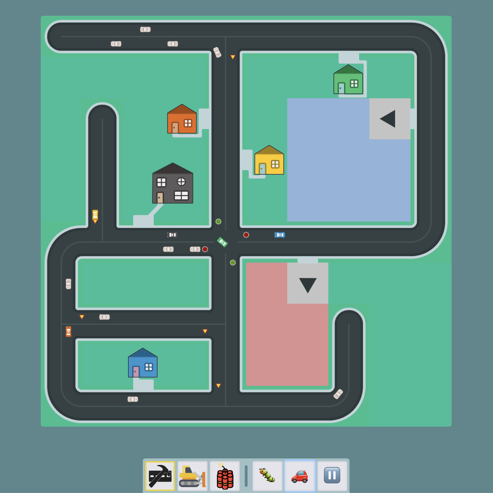

# Liikennematto

Liikennematto (_Finnish for a "traffic mat"_) is a prototype village builder game with a tiny scale. Inspired by traffic mats that children play with. The prototype currently works like a board game where cars take turns in roaming around the "game board".

_Liikennematto in action! [Live demo](http://apps.butsku.com/liikennematto/)_

## Features

### Simulation

-   a two-lane road network on a grid
-   simple collision detection
-   signal intersections (traffic lights)
-   yield sign based intersections
-   stop sign based intersections
-   one-way streets (with some limits)
-   dead end streets
-   basic simulation control (pause/speed)
-   debug view

### Map editor

-   draw roads of all kind with the smart editor
    -   **left click / tap** to place a piece of road
    -   **right click** to remove road from the tile
-   toggle intersection control
-   change traffic direction (one-way / both)
-   bulldoze (_remove_) tiles [_for touch devices_]
-   blow up the board (_clear it_) with dynamite

#### Restrictions

Tiles cannot be placed everywhere. In order to avoid awkward road layouts, the editor restricts complexity.

## Demo & more information

> Liikennematto works best on a large screen with landscape orientation (iPad, laptops, desktops)

[Live demo (stable)](http://apps.butsku.com/liikennematto/)

[Preview version (often in sync with the master branch)](http://apps.butsku.com/liikennematto/next/)

Read more about the project from [Liikennematto dev blog #1: prototyping traffic simulation with Elm](https://matiasklemola.com/liikennematto-dev-blog-one)

[Follow me on Twitter](https://twitter.com/MatiasKlemola) for updates!

## Attribution

Thanks to [Kenney](https://kenney.nl/assets) for the free game assets (subset of the "Road Textures" and "Racing Pack" collections).

Icons made by <a href="https://www.flaticon.com/authors/smashicons" title="Smashicons">Smashicons</a> from <a href="https://www.flaticon.com/" title="Flaticon"> www.flaticon.com</a>
